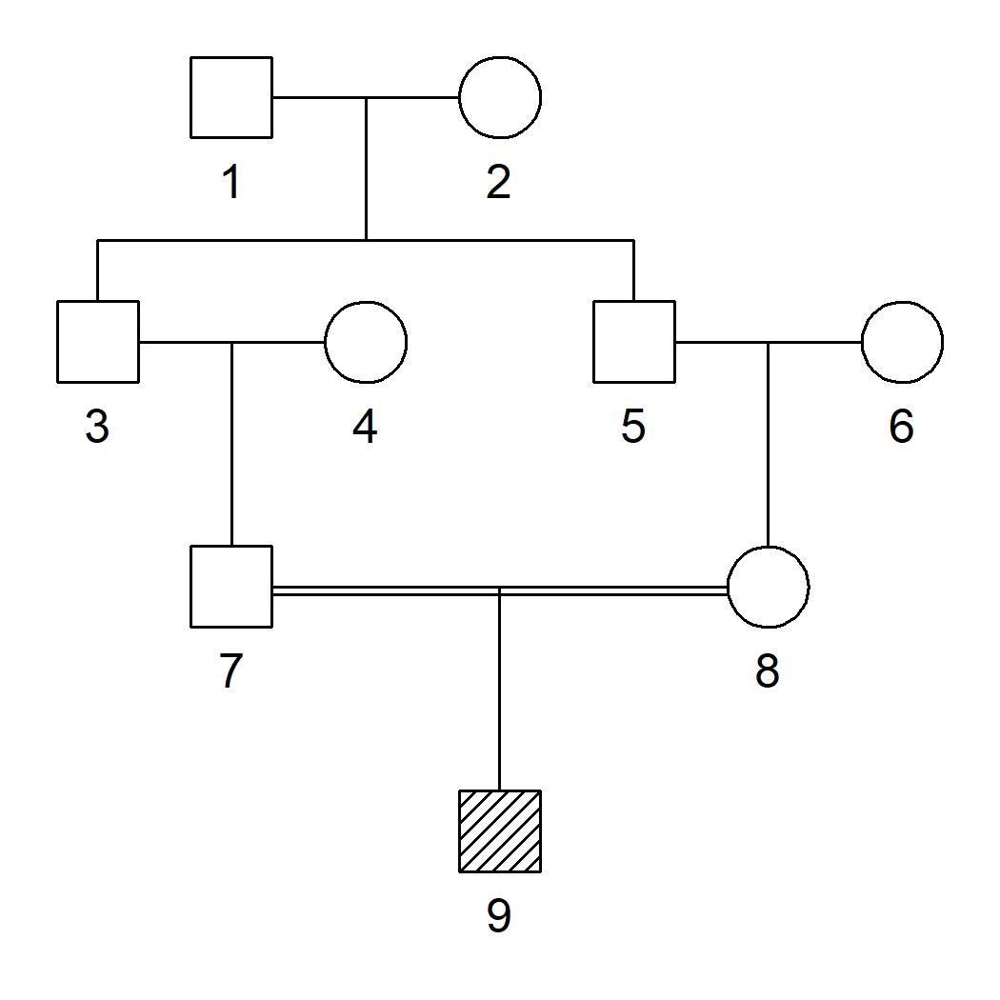
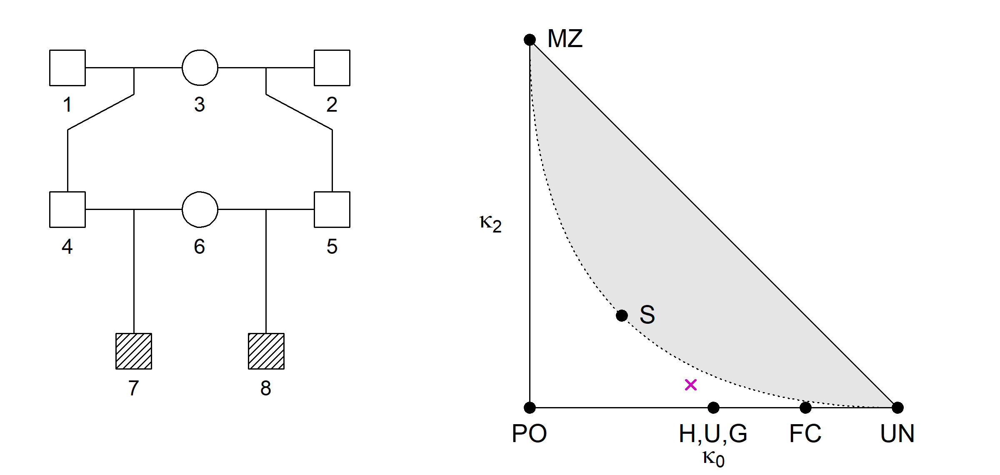

<!-- README.md is generated from README.Rmd. Please edit that file -->

# ribd 

<!-- badges: start -->

[](https://CRAN.R-project.org/package=ribd)
[](https://cran.r-project.org/package=ribd)
[](https://cran.r-project.org/package=ribd)
<!-- badges: end -->

## Overview

The goal of **ribd** is to compute various coefficients of relatedness
and identity-by-descent (IBD) between pedigree members. It is part of
the **pedsuite** collection of R packages for pedigree analysis; see
<https://magnusdv.github.io/pedsuite/> for details.

The main functions in **ribd** are the following, all of which support
both autosomal and X-chromosomal modes, and pedigrees with inbred
founders:

- `kinship()`: The kinship coefficient $\varphi$ between two pedigree
  members (or full matrix)
- `inbreeding()`: The inbreeding coefficient $f$ of all (or a subset of)
  pedigree members
- `kappaIBD()`: IBD coefficients $\kappa_0, \kappa_1, \kappa_2$ between
  noninbred individuals
- `identityCoefs()`: Jacquard’s condensed identity coefficients
  $\Delta_1, \dotsc, \Delta_9$

The package also computes a variety of lesser-known pedigree
coefficients:

- `gKinship()`: Generalised kinship coefficients of various kinds,
  including those defined by Karigl (1981), Weeks & Lange (1988), Lange
  & Sinsheimer (1992) and García-Cortés (2015).
- `multiPersonIBD()`: Multi-person IBD coefficients (noninbred
  individuals only)
- `twoLocusKinship()`: Two-locus kinship coefficients, as defined by
  Thompson (1988)
- `twoLocusIBD()`: Two-locus IBD coefficients (noninbred pair of
  individuals)
- `twoLocusIdentity()`: Two-locus condensed identity coefficients (any
  pair of individuals)
- `twoLocusGeneralisedKinship()`: Generalised two-locus kinship
  coefficients (*not exported*)

## Citation

If you use **ribd** in a publication, please cite the most appropriate
of the following works.

***Standard coefficients***  
Magnus D. Vigeland. Relatedness coefficients in pedigrees with inbred
founders. *Journal of Mathematical Biology*, **2020**.
[doi:10.1007/s00285-020-01505-x](https://doi.org/10.1007/s00285-020-01505-x).

***Two-locus coefficients***  
Magnus D. Vigeland. Two-locus identity coefficients in pedigrees. *G3
Genes\|Genomes\|Genetics*, **2023**.
[doi:10.1093/g3journal/jkac326](https://doi.org/10.1093/g3journal/jkac326).

***General reference***  
Magnus D. Vigeland. Pedigree analysis in R. Academic Press, **2021**.
[ISBN:9780128245606](https://shop.elsevier.com/books/pedigree-analysis-in-r/vigeland/978-0-12-824430-2).

## Installation

The easiest way to get started with **ribd** is to install the
**pedsuite**:

``` r
install.packages("pedsuite")
```

If you only want **ribd**, install from CRAN as follows:

``` r
install.packages("ribd")
```

Alternatively, the latest development version is available from GitHub:

``` r
# install.packages("devtools") # install devtools if needed
devtools::install_github("magnusdv/ribd")
```

## Getting started

In the following we illustrate the use of **ribd** by computing a few
well-known examples. We start by loading the package.

``` r
library(ribd)
#> Loading required package: pedtools
```

#### Inbreeding: A child of first cousins

For a child of related parents, its inbreeding coefficient is defined as
the probability of autozygosity (i.e., homologous alleles being IBD) in
a random autosomal locus.



For example, the child of first cousins shown above has inbreeding
coefficient 1/16. We can compute this with **ribd** as follows:

``` r
# Create pedigree
x = cousinPed(1, child = TRUE)
plot(x, hatched = 9)

# Inbreeding coefficient of the child
inbreeding(x, ids = 9)
#> [1] 0.0625
```

#### Kinship coefficient

By definition, the inbreeding coefficient equals the *kinship
coefficient* of the parents, individuals 7 and 8:

``` r
kinship(x, ids = 7:8)
#> [1] 0.0625
```

As expected, the result was again 1/16.

#### Kappa coefficients and the IBD triangle

For a pair of noninbred individuals, the three kappa coefficients are
defined as the probability that they have exactly 0, 1 or 2 alleles IBD,
respectively, at a random autosomal locus. For example, for a pair of
full siblings, this works out to be 1/4, 1/2 and 1/4, respectively.

Since the three kappa’s always sum to 1, any two of them are sufficient,
forming the coordinates of a point in the plane. This gives rise to the
*IBD triangle*, which is a useful tools for visualising (noninbred)
relationships. The implementation in **ribd** uses `kappa0` on the first
axis and `kappa2` on the second. In the example below, we place all
pairs of pedigree members in the triangle.

We validate this with the `kappaIBD()` function of **ribd**:

``` r
# Create and plot pedigree
y = nuclearPed(2)
plot(y, margin = 4)

# Compute kappa for all pairs
k = kappaIBD(y)

# IBD triangle
showInTriangle(k, labels = T, pos = c(3,2,3,4,4,3))
```


(If you have `ggplot2` and `ggrepel` installed, try
`showInTriangle(k, plotType = "gg")` for automatic separation of the
labels. There is also an interactive version, available with
`showInTriangle(k, plotType = "plotly")`.)

As shown by [Thompson
(1976)](https://doi.org/10.1111/j.1469-1809.1976.tb00181.x), all
relationships of noninbred individuals satisfy a certain quadratic
inequality in the kappa’s, resulting in an unattainable region of the
triangle (shown in grey above).

#### A more complex example

Here is a relationship in the *interior* of the attainable region of the
IBD triangle:

``` r
z = halfSibStack(2)
plot(z, hatched = 7:8, margin = c(3,2,2,2))

kap = kappaIBD(z, ids = 7:8)
showInTriangle(kap)
```



## The pairwise condensed identity states

The following figure shows the 9 *condensed identity states* of two
individuals *a* and *b*. Each state shows a pattern of identity by
descent (IBD) between the four homologous alleles. The four alleles are
represented as dots, with a connecting line segment indicating IBD. The
states are shown in the ordering used by Jacquard and most subsequent
authors.


#### Example: Full sib mating

The following relationship is perhaps the simplest example where all 9
coefficients are nonzero.

``` r
x = fullSibMating(1)
plot(x, hatched = 5:6)
```


The function `identityCoefs()` by default returns the nine coefficients
in the order given above.

``` r
identityCoefs(x, ids = 5:6)
#> [1] 0.06250 0.03125 0.12500 0.03125 0.12500 0.03125 0.21875 0.31250 0.06250
```

## Identity states on X

The X-chromosomal version of Jacquard’s identity coefficients can be
computed by adding `Xchrom = TRUE` in the call to `identityCoefs()`.
Here is the output for all pairs in the above pedigree:

``` r
identityCoefs(x, Xchrom = TRUE)
#>    id1 id2    D1    D2   D3   D4   D5  D6   D7  D8 D9
#> 1    1   2 0.000 0.000 0.00 1.00   NA  NA   NA  NA NA
#> 2    1   3 0.000 1.000   NA   NA   NA  NA   NA  NA NA
#> 3    1   4 0.000 0.000 1.00 0.00   NA  NA   NA  NA NA
#> 4    1   5 0.500 0.500   NA   NA   NA  NA   NA  NA NA
#> 5    1   6 0.000 0.250 0.50 0.25   NA  NA   NA  NA NA
#> 6    2   3 0.000 0.000   NA   NA 1.00 0.0   NA  NA NA
#> 7    2   4 0.000 0.000 0.00 0.00 0.00 0.0 0.00 1.0  0
#> 8    2   5 0.000 0.000   NA   NA 0.50 0.5   NA  NA NA
#> 9    2   6 0.000 0.000 0.00 0.00 0.25 0.0 0.25 0.5  0
#> 10   3   4 0.000 0.000 0.50 0.50   NA  NA   NA  NA NA
#> 11   3   5 0.250 0.750   NA   NA   NA  NA   NA  NA NA
#> 12   3   6 0.250 0.000 0.75 0.00   NA  NA   NA  NA NA
#> 13   4   5 0.000 0.000   NA   NA 1.00 0.0   NA  NA NA
#> 14   4   6 0.000 0.000 0.00 0.00 0.25 0.0 0.25 0.5  0
#> 15   5   6 0.125 0.125 0.50 0.25   NA  NA   NA  NA NA
```

A precise definition of these X-chromosomal coefficients requires some
explanation, which we give here.

As in the autosomal case, the identity coefficients on X are the
expected proportions of the possible IBD states involving the alleles at
a random locus (on X). The challenge is that the set of states depends
on the individual’s sex: F/F, F/M, M/F or M/M (were F = female and M =
male). The easiest case is F/F: When both are female, the states are
just as in the autosomal case.

Males, being hemizygous, have only 1 allele of a locus on X. Hence when
males are involved the total number of alleles is less than 4, rendering
the autosomal states pictured above meaningless. However, to avoid
drawing (and learning the ordering of) new states for each sex
combination, we can re-use the autosomal state pictograms by invoking
the following simple rule: **Replace the single allele of any male, with
a pair of autozygous alleles**. This gives a one-to-one map from the X
states to the autosomal states.

For simplicity the output always contains 9 coefficients, but with NA’s
in the positions of undefined states (depending on the sex combination).
Hopefully this should all be clear from the following table:


## Pedigrees with inbred founders

A unique feature of **ribd** (in fact, throughout the **pedsuite**
packages) is the support for inbred founders. This greatly expands the
set of pedigrees we can analyse with a computer.

#### Example

Here is a fun example using inbred founders: *A relationship exactly
midway (at least arithmetically speaking) between parent-child and full
siblings.* To achieve this, we modify the pedigree `z` from above
(half-sibs/half-cousins), giving two of the founders carefully chosen
inbreeding coefficients.

``` r
founderInbreeding(z, id = 3) = 3 - 2*sqrt(2)
founderInbreeding(z, id = 6) = 0.5 * sqrt(2)
```

Note that founder inbreeding is by default included in the pedigree
plot:

``` r
# Plot pedigree
plot(z, hatched = 7:8, labs = 7:8)

# IBD triangle
showInTriangle(kappaIBD(z, 7:8))
```


If you wonder how the weird-looking inbreeding coefficients above were
chosen, you can check out my paper [Relatedness coefficients in
pedigrees with inbred
founders](https://doi.org/10.1007/s00285-020-01505-x) (J Math Biol,
2020). In it I show that *any* point in the white region (including its
boundary) of the IBD triangle can be constructed as a double half cousin
relationship with suitable founder inbreeding.

The construction described in the paper is implemented in the function
`constructPedigree()` in **ribd**. For example, the following command
produces basically the pedigree in the previous figure:

``` r
w = constructPedigree(kappa = c(1/8, 6/8, 1/8))
#> Result:
#>   Paternal half cousins of degree 1; founder inbreeding 0.1716
#>   Maternal half siblings; founder inbreeding 0.7071
```
