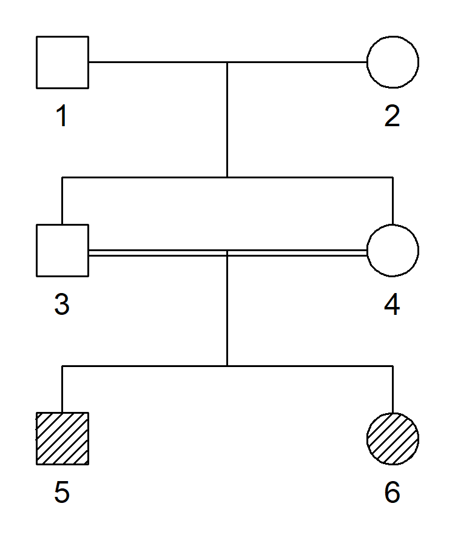

<!-- README.md is generated from README.Rmd. Please edit that file -->
ribd 
===============================================================

Overview
--------

The goal of `ribd` is to compute various coefficients of relatedness between pedigree members. It extends the `pedtools` package which is used for pedigree construction and manipulation.

The main functions in ribd are prefixed with `ibd_`:

-   `ibd_kinship()` : Computes the autosomal kinship matrix
-   `ibd_kinship_x()` : Computes the X chromosomal kinship matrix (TODO!)

-   `ibd_identity()` : Computes the autosomal condensed identity coefficients of two pedigree members
-   `ibd_identity_x()` : Computes the X chromosomal condensed identity coefficients of two pedigree members

A novel feature of `ribd` is the ability to handle pedigrees with inbred founders. More about this below!

Installation
------------

`ribd` is available for download from GitHub as follows:

``` r
 # First install devtools if needed
if(!require(devtools)) install.packages("devtools")

# Install ribd from github
devtools::install_github("magnusdv/ribd")
```

Getting started
---------------

``` r
library(pedtools)
library(ribd)
```

To illustrate the use of `ribd` we compute the condensed identity coefficients after one generation of full sib mating. This is a suitable example because the answer is well known, and it is one of the simplest in which all 9 coefficients are non-zero.

We create the pedigree with `pedtools` as follows:

``` r
x = fullSibMating(2)
plot(x)
```



The identity coefficients are computed with `ibd_identity()`

``` r
ibd_identity(x, ids = 5:6, verbose = F)
#> [1] 0.06250 0.03125 0.12500 0.03125 0.12500 0.03125 0.21875 0.31250 0.06250
```

Inbred founders
---------------

How would the above result would change if individual 1 was in fact not a founder, but himself inbred. The "normal" approach to such a question would be to expand the pedigree `x` to include the complete family history. To illustrate, let us suppose he is the child of half siblings. We construct this by merging `x` with a suitably labeled half-sib pedigree:

``` r
y = halfCousinsPed(0, child = T)
y = relabel(y, c(101:105, 1)) # prepare merge by relabeling
z = mergePed(x, y)
plot(z)
```


Now that we have the complete pedigree we can answer the question by running `ibd_identity()` on `z`.

``` r
ibd_identity(z, ids = 5:6, verbose = F)
#> [1] 0.06640625 0.03515625 0.13281250 0.03125000 0.13281250 0.03125000
#> [7] 0.21875000 0.29687500 0.05468750
```

Allthough the above strategy worked nicely in this case, it quickly gets awkward or impossible to model founder inbreeding by creating the complete pedigree. For example, inbreeding coefficients close to zero require enormous pedigrees! And even worse: What if individual 1 was 100% inbred? This cannot be modelled in this way, as it calls for an infinite pedigree.

A much easier approach is to use the `founder_inbreeding()` feature offered by `pedtools`: We simply specify the inbreeding level of individual 1 (in the original `x`) to be that of a child of half siblings, i.e. 1/8.

``` r
founder_inbreeding(x, ids = 1) = 1/8
```

When we now run `ibd_identity()` on `x`, this inbreeding is taken into account, giving the same answer as above.

``` r
ibd_identity(x, ids = 5:6, verbose = F)
#> [1] 0.06640625 0.03515625 0.13281250 0.03125000 0.13281250 0.03125000
#> [7] 0.21875000 0.29687500 0.05468750
```

NB: At the moment inbred founders are not allowed in the X-chromosomal methods.
