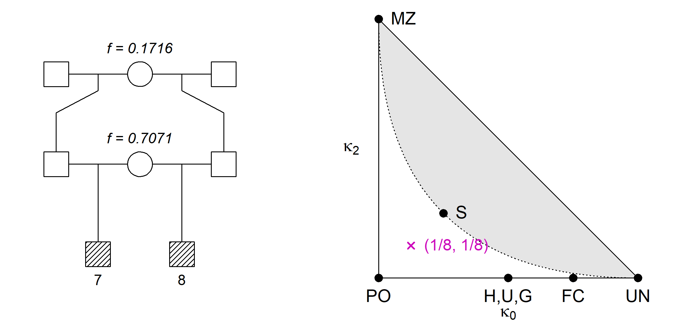
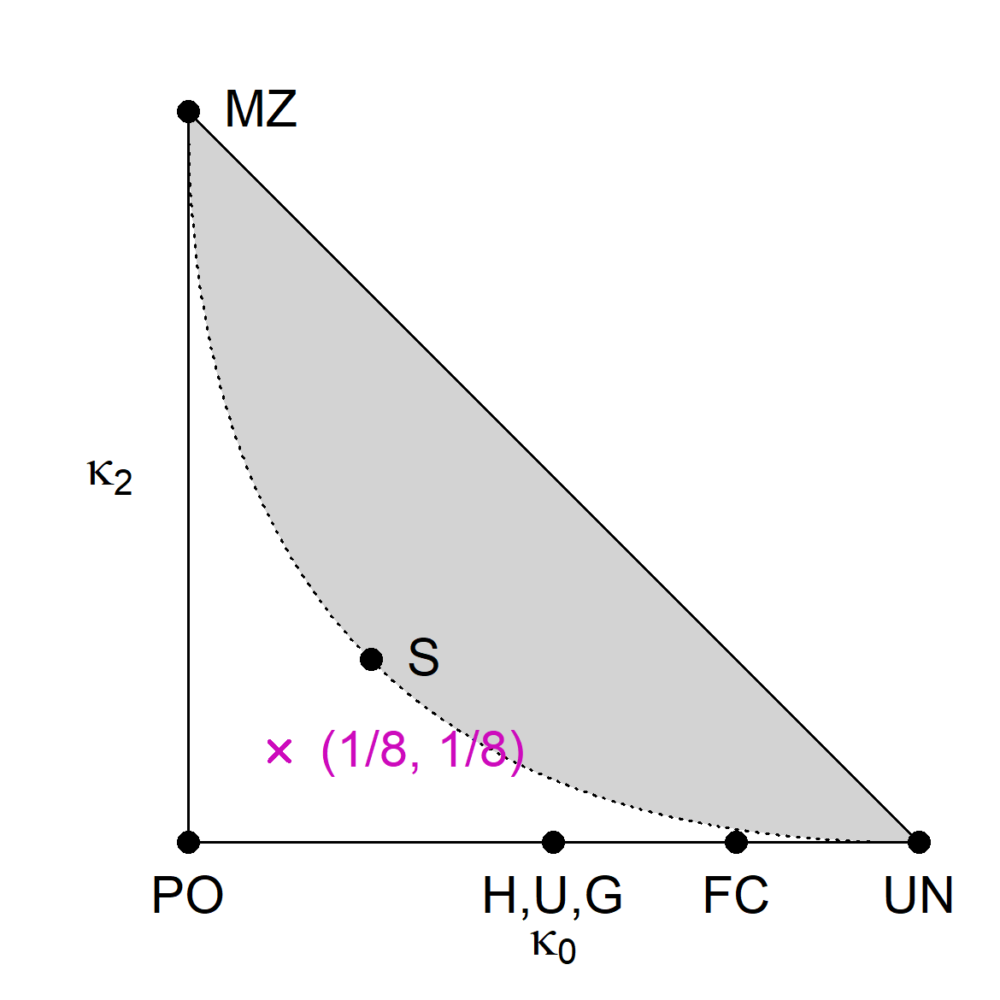

<!-- README.md is generated from README.Rmd. Please edit that file -->

# ribd 

<!-- badges: start -->

[](https://CRAN.R-project.org/package=ribd)
[](https://cran.r-project.org/package=ribd)
[](https://cran.r-project.org/package=ribd)
<!-- badges: end -->

## Overview

The goal of **ribd** is to compute various coefficients of relatedness
and identity-by-descent (IBD) between pedigree members. It extends the
`pedtools` package which provides useful utilities for pedigree
construction and manipulation.

The main functions in **ribd** are the following, all of which support
both autosomal and X-chromosomal modes:

-   `kinship()` : Kinship coefficients
-   `inbreeding()` : Inbreeding coefficients
-   `kappaIBD()` : IBD coefficients `kappa = (k0, k1, k2)` between
    noninbred individuals
-   `condensedIdentity()` : Jacquard’s condensed identity coefficients

A unique feature of **ribd** is the ability to handle pedigrees with
inbred founders in all of the above calculations. More about this below!

The package also computes a variety of lesser-known pedigree
coefficients:

-   `generalisedKinship()` : Generalised kinship coefficients, as
    defined by Weeks and Lange (1988)
-   `multiPersonIBD()` : Multi-person IBD coefficients (noninbred
    individuals only)
-   `twoLocusKinship()` : Two-locus kinship coefficients, as defined by
    Thompson (1988)
-   `twoLocusIBD()` : Two-locus IBD coefficients (noninbred pair of
    individuals)
-   `twoLocusIdentity()` : Two-locus condensed identity coefficients
    (any pair of individuals)
-   `twoLocusGeneralisedKinship()` : Generalised two-locus kinship
    coefficients (*not exported*)

## Installation

To get the current official version of **ribd**, install from CRAN as
follows:

``` r
install.packages("ribd")
```

Alternatively, you can obtain the latest development version from
GitHub:

``` r
# install.packages("devtools") # install devtools if needed
devtools::install_github("magnusdv/ribd")
```

## Getting started

In the following we illustrate the use of **ribd** by computing a few
well-known examples. We start by loading the package.

``` r
library(ribd)
#> Loading required package: pedtools
```

#### Inbreeding: A child of first cousins

For a child of related parents, its inbreeding coefficient is defined as
the probability of autozygosity (i.e., homologous alleles being IBD) in
a random autosomal locus.


For example, the child of first cousins shown above has inbreeding
coefficient 1/16. We can compute this with **ribd** as follows:

``` r
# Create pedigree
x = cousinPed(1, child = TRUE)

# Plot pedigree
plot(x)

# Inbreeding coefficient of the child
inbreeding(x, ids = 9)
#> [1] 0.0625
```

#### Kinship coefficient

By theory, the above inbreeding coefficient should equal the *kinship
coefficient* between the parents, i.e., the two cousins `7` and `8`:

``` r
kinship(x, ids = 7:8)
#> [1] 0.0625
```

As expected, the result was again 1/16.

#### Kappa coefficients and the IBD triangle

For a pair of noninbred individuals, the three `kappa` coefficients are
defined as the probability that they have exactly 0, 1 or 2 alleles IBD,
respectively, at a random autosomal locus. For example, for a pair of
full siblings, this works out to be 1/4, 1/2 and 1/4, respectively.

Since the three kappa’s always sum to 1, any two of them are sufficient,
forming the coordinates of a point in the plane. This gives rise to the
*IBD triangle*, which is a useful tools for visualising (noninbred)
relationships. The implementation in **ribd** uses `kappa0` on the first
axis and `kappa2` on the second. In the example below, we place all
pairs of pedigree members in the triangle.

We validate this with the `kappaIBD()` function of **ribd**:

``` r
# Create and plot pedigree
y = nuclearPed(2)
plot(y, margin = rep(4, 4))

# Compute kappa for all pairs
k = kappaIBD(y)

# IBD triangle
showInTriangle(k, labels = T, cexLab = 1.3, pos = c(3,2,3,4,4,3))
```


As shown by [Thompson
(1976)](https://doi.org/10.1111/j.1469-1809.1976.tb00181.x), all
relationships of noninbred individuals satisfy a certain quadratic
inequality in the kappa’s, resulting in an unattainable region of the
triangle (shown in gray above).

#### A more complex example

Here is a relationship in the *interior* of the attainable region of the
IBD triangle:

``` r
z = halfSibStack(2)
plot(z, hatched = 7:8, margin = c(3,2,2,2))

kap = kappaIBD(z, ids = 7:8)
showInTriangle(kap)
```


## The pairwise condensed identity states

The following figure shows the 9 *condensed identity states* of two
individuals *a* and *b*. Each state shows a pattern of identity by
descent (IBD) between the four homologous alleles. The four alleles are
represented as dots, with a connecting line segment indicating IBD. The
states are shown in the ordering used by Jacquard and most subsequent
authors.


#### Example: Full sib mating

The following relationship is perhaps the simplest example where all 9
coefficients are nonzero.

``` r
x = fullSibMating(1)
plot(x, hatched = 5:6)
```


The function `condensedIdentity()` returns the nine coefficients in the
order given above.

``` r
condensedIdentity(x, ids = 5:6)
#> [1] 0.06250 0.03125 0.12500 0.03125 0.12500 0.03125 0.21875 0.31250 0.06250
```

## Identity states on X

The X chromosomal version of `condensedIdentity()` is called
`condensedIdentityX()`. What this function computes requires some
explanation, which we offer here.

As in the autosomal case, the identity coefficients on X are the
expected proportions of the possible IBD states involving the alleles at
a random locus (on X). The challenge is that the set of states depends
on the individual’s sex: F/F, F/M, M/F or M/M (were F = female and M =
male). The easiest case is F/F: When both are female, the states are
just as in the autosomal case.

Males, being hemizygous, have only 1 allele of a locus on X. Hence when
males are involved the total number of alleles is less than 4, rendering
the autosomal states pictured above meaningless. However, to avoid
drawing (and learning the ordering of) new states for each sex
combination, we can re-use the autosomal state pictograms by invoking
the following simple rule: **Replace the single allele of any male, with
a pair of autozygous alleles**. This gives a one-to-one map from the X
states to the autosomal states.

For simplicity the output always contains 9 coefficients, but with NA’s
in the positions of undefined states (depending on the sex combination).
Hopefully this should all be clear from the following table:


## Pedigrees with inbred founders

A unique feature of **ribd** (in fact, throughout the **ped suite**
packages) is the support for inbred founders. This greatly expands the
set of pedigrees we can analyse with a computer.

#### Example

Here is a fun example using inbred founders: *A relationship exactly
midway (at least arithmetically speaking) between parent-child and full
siblings.* To achieve this, we modify the pedigree `z` from above
(half-sibs/half-cousins), giving two of the founders carefully chosen
inbreeding coefficients.

``` r
founderInbreeding(z, id = 3) = 3 - 2*sqrt(2)
founderInbreeding(z, id = 6) = 0.5 * sqrt(2)
```

Note that founder inbreeding is by default included in the pedigree
plot:

``` r
# Plot pedigree
plot(z, hatched = 7:8)

# IBD triangle
showInTriangle(kappaIBD(z, 7:8))
```



If you wonder how the weird-looking inbreeding coefficients above were
chosen, you can check out my paper [Relatedness coefficients in
pedigrees with inbred
founders](https://doi.org/10.1007/s00285-020-01505-x) (J Math Biol,
2020). In it I show that *any* point in the white region of the IBD
triangle can be constructed as a double half cousin relationship with
suitable founder inbreeding.

The construction described in the paper is implemented in the function
`constructPedigree()` in **ribd**. For example, the following command
produces basically the pedigree in the previous figure:

``` r
w = constructPedigree(kappa = c(1/8, 6/8, 1/8))
#> Result:
#>   Paternal half cousins of degree 1; founder inbreeding 0.1716
#>   Maternal half siblings; founder inbreeding 0.7071
```
